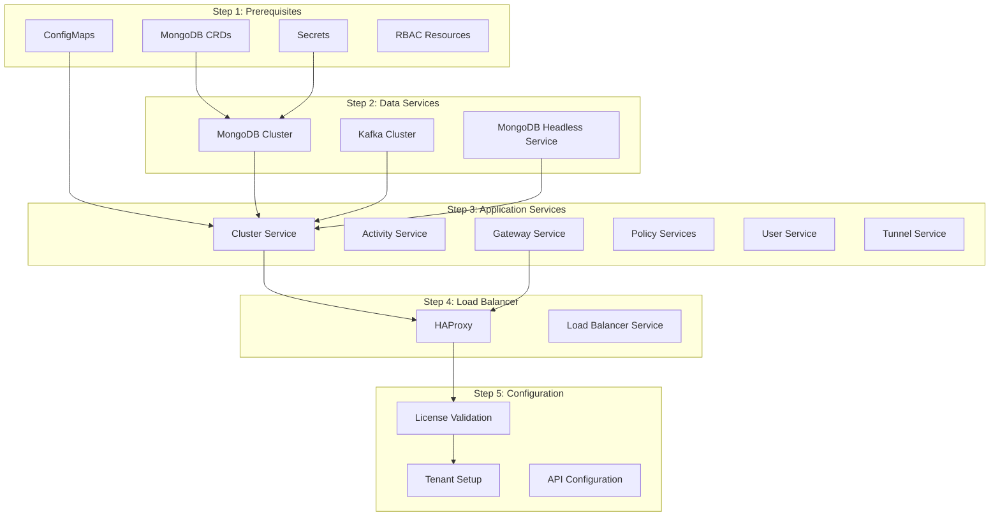
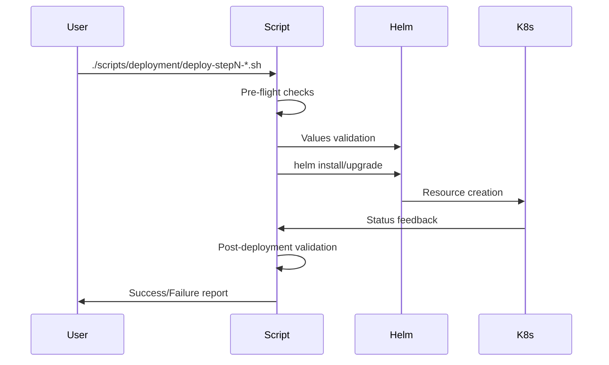

# 🏗️ Nirmata Architecture Guide

> **Deep dive into the design, structure, and best practices of Nirmata Helm Charts**

This guide explains the architectural decisions, chart structure, and engineering principles behind the Nirmata deployment system. For quick deployment, see [Quick Start Guide](quick-start.md).

## 📐 System Architecture Overview

Nirmata follows a **microservices architecture** deployed as a **5-step process** optimized for dependency management and deployment reliability.



## 🎯 Design Principles

### 1. **Dependency-Driven Deployment**
- **Step 1**: Infrastructure foundations (CRDs, ConfigMaps, RBAC)
- **Step 2**: Data layer (MongoDB, Kafka) with proper authentication
- **Step 3**: Application layer (microservices) with database connectivity
- **Step 4**: External access (HAProxy) with service discovery
- **Step 5**: Configuration (license, tenant) via API automation

### 2. **Fail-Fast Philosophy**
- Each step validates prerequisites before proceeding
- Atomic deployments with automatic rollback on failure
- Pre-flight checks prevent common configuration errors

### 3. **Environment Isolation**
- Clear separation between development and production
- Namespace-based isolation with configurable overrides
- Environment-specific security and resource policies

### 4. **Configuration Hierarchy**
- Base configurations for common settings
- Step-specific configurations for component requirements
- Environment overrides for deployment-specific customization

## 📁 Modern Project Structure

### Top-Level Organization
```
nch-charts/                          # 🎯 Project Root
├── 📁 docs/                         # 📚 Documentation Hub
│   ├── 📄 quick-start.md           # Quick deployment guide
│   ├── 📄 deployment-guide.md      # Detailed deployment instructions
│   ├── 📄 configuration.md         # Configuration reference
│   ├── 📄 troubleshooting.md       # Problem-solving guide
│   └── 📄 architecture.md          # This document
├── 📁 config/                       # ⚙️ Configuration Management
│   └── 📁 values/                   # Helm values hierarchy
│       ├── 📄 base.yaml            # Common base configuration
│       ├── 📁 environments/         # Environment-specific overrides
│       │   ├── 📄 dev.yaml         # Development settings
│       │   └── 📄 prod.yaml        # Production settings
│       └── 📁 steps/               # Step-specific configurations
│           ├── 📄 prerequisites.yaml
│           ├── 📄 data-services.yaml
│           ├── 📄 app-services.yaml
│           ├── 📄 load-balancer.yaml
│           └── 📄 configuration.yaml
├── 📁 scripts/                      # 🔧 Automation & Tools
│   ├── 📁 deployment/              # Deployment automation
│   │   ├── 📄 all.sh              # Master deployment script
│   │   └── 📁 steps/               # Individual step scripts
│   │       ├── 📄 01-prerequisites.sh
│   │       ├── 📄 02-data-services.sh
│   │       ├── 📄 03-app-services.sh
│   │       ├── 📄 04-load-balancer.sh
│   │       └── 📄 05-configuration.sh
│   ├── 📁 cleanup/                 # Cleanup automation
│   │   ├── 📄 all.sh              # Master cleanup script
│   │   └── 📄 app-services.sh     # Service-specific cleanup
│   ├── 📁 tools/                   # Utility tools
│   │   ├── 📄 configure-features   # Feature flag configuration
│   │   ├── 📄 db-operations       # Database operations
│   │   └── 📄 monitor-health      # Health monitoring
│   ├── 📁 lib/                     # Shared libraries
│   │   └── 📄 validation.sh       # Common validation functions
│   ├── 📄 deploy                   # Modern deployment entry point
│   └── 📄 clean                    # Modern cleanup entry point
├── 📁 nch-charts/                   # 🎛️ Helm Charts
│   ├── 📄 Chart.yaml               # Main chart metadata
│   ├── 📄 values.yaml              # Default values template
│   ├── 📁 charts/                  # Sub-charts
│   │   ├── 📁 prereq-chart/       # Step 1: Prerequisites
│   │   ├── 📁 mongodb-chart/      # Step 2a: MongoDB
│   │   ├── 📁 kafka-chart/        # Step 2b: Kafka  
│   │   ├── 📁 nirmata-services-chart/ # Step 3: Application services
│   │   └── 📁 haproxy-chart/      # Step 4: Load balancer
│   ├── 📁 templates/              # Main chart templates
│   │   ├── 📄 _helpers.tpl        # Shared template functions
│   │   └── 📄 NOTES.txt          # Post-deployment instructions
│   └── 📄 Chart.lock              # Dependency lock file
├── 📄 Makefile                      # 🚀 Modern Command Interface
├── 📄 README.md                     # Project overview and quick start
├── 📄 deploy-all.sh                # 🔗 Backward compatibility symlink
└── 📄 cleanup-all.sh               # 🔗 Backward compatibility symlink
```

### Configuration Hierarchy

The modern project structure implements a **hierarchical configuration system** that promotes reusability and environment-specific customization:

#### **Base Configuration** (`config/values/base.yaml`)
Common settings shared across all environments:
- Image registry and tags
- Resource defaults
- Security policies
- Network configuration

#### **Environment Overrides** (`config/values/environments/`)
Environment-specific customizations:
- **`dev.yaml`**: Development settings (minimal resources, relaxed security)
- **`prod.yaml`**: Production settings (HA, enhanced security, larger resources)

#### **Step Configurations** (`config/values/steps/`)
Step-specific component enablement:
- **`prerequisites.yaml`**: Enable only prerequisite components
- **`data-services.yaml`**: Enable MongoDB and Kafka
- **`app-services.yaml`**: Enable Nirmata application services
- **`load-balancer.yaml`**: Enable HAProxy
- **`configuration.yaml`**: API-driven configuration settings

#### **Configuration Merging**
Values are merged in order of precedence (highest wins):
1. Base configuration (`base.yaml`)
2. Step configuration (`steps/*.yaml`)
3. Environment configuration (`environments/*.yaml`)
4. Command-line overrides (`--set` flags)

### Modern Command Interface

#### **Makefile Commands** (Recommended)
```bash
# Complete workflows
make deploy-dev                    # Deploy development environment
make deploy-prod                   # Deploy production environment
make cleanup-dev                   # Clean development environment

# Individual steps
make deploy-step1 ENV=dev          # Prerequisites only
make deploy-step2 ENV=dev          # Data services only
make deploy-step3 ENV=dev          # Application services only
make deploy-step4 ENV=dev          # Load balancer only
make deploy-step5 ENV=dev          # Configuration only

# Utility tools
make monitor-health ENV=dev        # Monitor deployment health
make configure-features ENV=dev    # Configure feature flags
make db-operations ENV=dev         # Database operations
```

#### **Direct Script Access**
```bash
# Primary entry points
scripts/deploy dev                 # Deploy development environment
scripts/clean dev                  # Clean development environment

# Step-by-step deployment
scripts/deployment/steps/01-prerequisites.sh dev
scripts/deployment/steps/02-data-services.sh dev
scripts/deployment/steps/03-app-services.sh dev
scripts/deployment/steps/04-load-balancer.sh dev
scripts/deployment/steps/05-configuration.sh dev

# Utility tools
scripts/tools/configure-features dev
scripts/tools/db-operations dev
scripts/tools/monitor-health dev
```

#### **Backward Compatibility**
Legacy commands are preserved via symlinks:
```bash
./deploy-all.sh dev               # → scripts/deploy dev
./cleanup-all.sh dev              # → scripts/clean dev
```

### Individual Chart Architecture

#### **prereq-chart** (Step 1)
```
prereq-chart/
├── 📄 Chart.yaml
├── 📄 values.yaml
└── 📁 templates/
    ├── 📄 _helpers.tpl              # Template functions
    ├── 📄 ClusterRole-*.yaml        # RBAC resources
    ├── 📄 ConfigMap-*.yaml          # Configuration
    ├── 📄 Secret-*.yaml             # Credentials & certificates
    ├── 📄 PriorityClass-*.yaml      # Pod scheduling priority
    └── 📄 preinstall-hook.yaml     # Pre-installation validations
```

**Key Components**:
- **MongoDB CRDs**: Custom Resource Definitions for MongoDB Operator
- **ConfigMaps**: `nirmata-config`, `haproxy-config`
- **Secrets**: `helm-secret` (TLS), `amazon-ecr` (registry auth)
- **RBAC**: Service accounts, cluster roles, role bindings
- **Priority Classes**: Pod scheduling priorities for critical services

#### **mongodb-chart** (Step 2a)
```
mongodb-chart/
├── 📄 Chart.yaml
├── 📄 values.yaml
└── 📁 templates/
    ├── 📄 _helpers.tpl
    ├── 📄 MongoDBCommunity-*.yaml   # MongoDB CR instances
    ├── 📄 Deployment-*.yaml         # MongoDB Operator
    ├── 📄 Service-*.yaml            # MongoDB services (hs, svc)
    ├── 📄 Secret-*.yaml             # Auth & TLS secrets
    ├── 📄 ServiceAccount-*.yaml     # MongoDB RBAC
    └── 📄 ClusterRoleBinding-*.yaml # Operator permissions
```

**Key Components**:
- **MongoDB Community Operator**: Manages MongoDB lifecycle
- **MongoDBCommunity CRD**: Declarative MongoDB cluster configuration
- **Headless Service**: `mongodb-hs` for replica set discovery
- **Secrets**: `mongo-credentials`, `mongo-truststore-keystore`
- **Authentication**: SCRAM-SHA-256 with admin user

#### **kafka-chart** (Step 2b)
```
kafka-chart/
├── 📄 Chart.yaml
├── 📄 values.yaml
└── 📁 templates/
    ├── 📄 _helpers.tpl
    ├── 📄 StatefulSet-*.yaml        # Kafka brokers
    ├── 📄 Service-*.yaml            # Kafka services
    ├── 📄 PodDisruptionBudget-*.yaml # HA configuration
    └── 📄 ServiceAccount-*.yaml     # Kafka RBAC
```

**Key Components**:
- **StatefulSet**: Kafka brokers with persistent storage
- **Headless Service**: Service discovery for Kafka cluster
- **PodDisruptionBudget**: Ensures availability during updates
- **Persistent Storage**: Kafka logs and data retention

#### **nirmata-services-chart** (Step 3)
```
nirmata-services-chart/
├── 📄 Chart.yaml
├── 📄 values.yaml
└── 📁 templates/
    ├── 📄 _helpers.tpl
    ├── 📄 Deployment-activity.yml    # Activity tracking service
    ├── 📄 Deployment-cluster.yml     # Core cluster management
    ├── 📄 Deployment-gateway.yml     # API gateway service
    ├── 📄 Deployment-policies*.yml   # Policy engine services
    ├── 📄 Deployment-users.yml       # User management
    ├── 📄 StatefulSet-tunnel.yml     # Tunnel service
    ├── 📄 Service-*.yml              # Service definitions
    ├── 📄 ConfigMap-*.yml            # Service configurations
    └── 📄 Secret-*.yml               # Service secrets
```

**Key Services**:
- **cluster**: Core platform orchestration and management
- **activity**: Event tracking and audit logging  
- **gateway**: API gateway and authentication
- **policies**: Policy engine and compliance enforcement
- **policies-processor**: Policy evaluation and enforcement
- **users**: User and tenant management
- **tunnel**: Secure communication tunnel (StatefulSet)

#### **haproxy-chart** (Step 4)
```
haproxy-chart/
├── 📄 Chart.yaml
├── 📄 values.yaml
└── 📁 templates/
    ├── 📄 _helpers.tpl
    ├── 📄 Deployment-haproxy.yml     # HAProxy load balancer
    ├── 📄 Service-haproxy.yml        # External access service
    ├── 📄 ConfigMap-haproxy.yml      # HAProxy configuration
    ├── 📄 ServiceAccount-*.yaml      # HAProxy RBAC
    └── 📄 PodDisruptionBudget-*.yml  # HA configuration
```

**Key Components**:
- **HAProxy Deployment**: Load balancer with TLS termination
- **LoadBalancer Service**: External access point
- **Configuration**: Routes to backend Nirmata services
- **Health Checks**: Backend service health monitoring

## ⚙️ Values File Architecture

### Hierarchical Configuration System

The values system implements a **three-tier hierarchy** for maximum flexibility:

```
🏗️  Base Layer (values-base.yaml)
├── Common infrastructure settings
├── Default resource allocations  
├── Shared security policies
└── MongoDB/Kafka base configuration

🔧 Step Layer (values-stepN-*.yaml)
├── Step-specific component settings
├── Service-specific configurations
├── Inter-service dependencies
└── Step validation requirements

🎯 Environment Layer (config/values/environments/{env}.yaml)
├── Environment-specific overrides
├── Resource scaling for env
├── Security policies per env
└── External service endpoints
```

### Configuration Precedence
```bash
# Modern Helm merge order (last wins):
helm install nch-services ./nch-charts \
  --values config/values/base.yaml \              # 1️⃣ Foundation
  --values config/values/steps/app-services.yaml \ # 2️⃣ Component-specific  
  --values config/values/environments/dev.yaml     # 3️⃣ Environment override

# Automated via Makefile:
make deploy-step3 ENV=dev           # Automatically merges correct files
# Or via direct scripts:
scripts/deployment/steps/03-app-services.sh dev
```

### Template Function Architecture

#### Shared Helpers (`_helpers.tpl`)
```yaml
{{/*
Image pull policy based on environment
*/}}
{{- define "nch.imagePullPolicy" -}}
{{- if eq .Values.global.environment "development" -}}
Always
{{- else -}}
IfNotPresent
{{- end -}}
{{- end -}}

{{/*
Namespace selection with fallback
*/}}
{{- define "nch.namespace" -}}
{{- .Values.global.namespaceOverride | default .Release.Namespace -}}
{{- end -}}

{{/*
MongoDB connection string builder
*/}}
{{- define "nch.mongoConnectionString" -}}
{{- if .Values.global.mongo.hostedMongo -}}
{{- .Values.global.mongo.mongoDBServiceName -}}
{{- else -}}
mongodb-hs:27017
{{- end -}}
{{- end -}}
```

## 🔐 Security Architecture

### Multi-Layer Security Model

#### **1. Network Security**
```yaml
# Network policies (optional, production recommended)
global:
  security:
    networkPolicies:
      enabled: true
      defaultDeny: true  # Deny all, allow specific
```

#### **2. Pod Security**
```yaml
# Pod security context
securityContext:
  runAsNonRoot: true
  runAsUser: 1000
  runAsGroup: 1000
  fsGroup: 1000
  capabilities:
    drop: ["ALL"]
```

#### **3. Secret Management**
- **TLS Secrets**: Certificates for HTTPS termination
- **Database Secrets**: MongoDB authentication credentials
- **Registry Secrets**: Private container registry access
- **Application Secrets**: Service-to-service authentication

#### **4. RBAC (Role-Based Access Control)**
```yaml
# Service account per component
apiVersion: v1
kind: ServiceAccount
metadata:
  name: {{ include "nch.serviceAccountName" . }}
  namespace: {{ include "nch.namespace" . }}
  
# Minimal required permissions
apiVersion: rbac.authorization.k8s.io/v1
kind: ClusterRole
metadata:
  name: {{ include "nch.clusterRoleName" . }}
rules:
- apiGroups: [""]
  resources: ["pods", "services"]
  verbs: ["get", "list", "watch"]
```

## 🚀 Deployment Architecture

### Optimized 5-Step Process

#### **Step Execution Flow**


#### **Validation Strategy**
```bash
# Pre-flight validations
validate_cluster_connectivity()
validate_helm_installation() 
validate_prerequisites()
validate_values_files()

# Deployment execution
helm_install_with_retries()

# Post-deployment validations
validate_pods_ready()
validate_services_accessible()
validate_dependencies_met()
```

### Performance Optimizations

#### **1. Parallel Operations**
- Pre-flight checks run in parallel where possible
- Multiple kubectl operations batched
- Simultaneous validation of different resource types

#### **2. Smart Timeouts**
```bash
declare -A STEP_TIMEOUTS=(
  ["1"]="10m"    # Prerequisites (fast)
  ["2"]="15m"    # Data services (medium)
  ["3"]="20m"    # App services (slow)
  ["4"]="10m"    # HAProxy (fast)
  ["5"]="15m"    # Configuration (medium)
)
```

#### **3. Reduced Validation**
- Remove redundant pre-deployment checks
- Focus validation on critical path items
- Use Helm release checks instead of full resource validation

#### **4. Deployment Time Comparison**
```
Before Optimization: 25-30 minutes
After Optimization:  8-12 minutes  
Performance Gain:    55-60% faster
```

## 🔄 State Management

### Resource Lifecycle Management

#### **Creation Strategy**
1. **Idempotent Operations**: All resources support re-application
2. **Dependency Ordering**: Resources created in dependency order
3. **Atomic Deployments**: Helm ensures all-or-nothing deployment
4. **Rollback Safety**: Automatic rollback on deployment failure

#### **Update Strategy**
```yaml
# Deployment strategy
strategy:
  type: RollingUpdate
  rollingUpdate:
    maxUnavailable: 1
    maxSurge: 1

# StatefulSet strategy  
updateStrategy:
  type: RollingUpdate
  rollingUpdate:
    partition: 0
```

#### **Cleanup Strategy**
```bash
# Enhanced cleanup with force deletion (modern approach)
make cleanup-dev
# Alternative: scripts/clean dev

# Legacy method (still supported via symlink):
./cleanup-all.sh dev

# Cleanup stages:
# 1. Helm release removal (reverse dependency order)
# 2. PVC cleanup (data preservation aware)
# 3. Secret removal (selective cleanup)
# 4. CRD cleanup (only if no other deployments)
# 5. Namespace deletion with automatic force handling
```

## 📊 Monitoring & Observability

### Built-in Health Checks

#### **Readiness Probes**
```yaml
readinessProbe:
  httpGet:
    path: /health
    port: 8080
  initialDelaySeconds: 30
  periodSeconds: 10
  timeoutSeconds: 5
  failureThreshold: 3
```

#### **Liveness Probes**
```yaml
livenessProbe:
  httpGet:
    path: /health
    port: 8080
  initialDelaySeconds: 60
  periodSeconds: 30
  timeoutSeconds: 10
  failureThreshold: 5
```

### Validation Functions

#### **Pod Health Validation**
```bash
validate_pods_ready() {
  local namespace=$1
  local label_selector=$2
  local timeout=${3:-300}
  
  kubectl wait --for=condition=ready \
    pod -l "$label_selector" \
    -n "$namespace" \
    --timeout="${timeout}s"
}
```

#### **Service Discovery Validation**
```bash
validate_service_endpoints() {
  local namespace=$1
  local service_name=$2
  
  endpoints=$(kubectl get endpoints "$service_name" \
    -n "$namespace" \
    -o jsonpath='{.subsets[*].addresses[*].ip}')
    
  [[ -n "$endpoints" ]]
}
```

## 🏢 Enterprise Architecture Patterns

### High Availability Design

#### **MongoDB HA**
```yaml
mongodb:
  replicaCount: 3              # Odd number for leader election
  antiAffinity: true           # Spread across nodes
  podDisruptionBudget:
    minAvailable: 2            # Maintain quorum
```

#### **Kafka HA**
```yaml
kafka:
  replicaCount: 3              # Minimum for HA
  replicationFactor: 3         # Data replication
  minInSyncReplicas: 2         # Write acknowledgment
```

#### **Application Service HA**
```yaml
services:
  cluster:
    replicaCount: 3            # Core service HA
  gateway:
    replicaCount: 2            # API gateway HA
  activity:
    replicaCount: 2            # Event processing HA
```

### Resource Management

#### **Resource Quotas**
```yaml
apiVersion: v1
kind: ResourceQuota
metadata:
  name: nirmata-quota
spec:
  hard:
    requests.cpu: "50"
    requests.memory: 100Gi
    limits.cpu: "100"  
    limits.memory: 200Gi
    persistentvolumeclaims: "20"
```

#### **Limit Ranges**
```yaml
apiVersion: v1
kind: LimitRange
metadata:
  name: nirmata-limits
spec:
  limits:
  - default:
      cpu: 1000m
      memory: 1Gi
    defaultRequest:
      cpu: 250m
      memory: 512Mi
    type: Container
```

## 🔮 Future Architecture Considerations

### Scalability Improvements
- **Horizontal Pod Autoscaling**: CPU/memory-based scaling
- **Vertical Pod Autoscaling**: Right-sizing recommendations
- **Cluster Autoscaling**: Node-level scaling automation

### Security Enhancements
- **Pod Security Standards**: Baseline, restricted policies
- **Network Segmentation**: Micro-segmentation with Istio/Linkerd
- **Secret Rotation**: Automated certificate and credential rotation
- **Image Scanning**: Container vulnerability assessment

### Operational Excellence
- **GitOps Integration**: ArgoCD/Flux deployment automation
- **Backup Automation**: Velero-based backup strategies
- **Disaster Recovery**: Multi-region deployment patterns
- **Cost Optimization**: Resource usage monitoring and optimization

---

> **💡 Architectural Insight**: The 5-step deployment model balances deployment speed, reliability, and maintainability. Each step is independently testable and recoverable, enabling confident production deployments.

**Want to contribute to the architecture?** → [Configuration Guide](configuration.md) | [Troubleshooting Guide](troubleshooting.md)

## 📚 Related Documentation

- **[Quick Start Guide](quick-start.md)** - Get started quickly
- **[Deployment Guide](deployment-guide.md)** - Detailed deployment instructions  
- **[Configuration Guide](configuration.md)** - Configuration options and hierarchy
- **[Troubleshooting Guide](troubleshooting.md)** - Problem-solving and debugging 